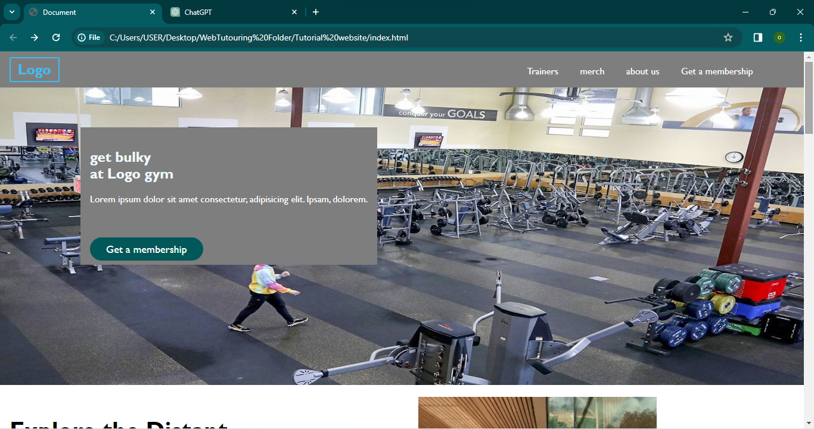

**GYM Landing Page**

Welcome to the Gym Landing Page project! This project is designed as part of an HTML and CSS course to help you understand the fundamentals of web development. In this project, you'll learn how to create a simple landing page for a gym using HTML and CSS.

### Getting Started

To get started with this project, simply download or clone the repository to your local machine. You can then open the project files in your preferred text editor or IDE.

### Project Structure

The project files are organized as follows:

- **index.html**: This file contains the HTML structure of the landing page.
- **styles.css**: This file contains the CSS styles to apply to the HTML elements.

### How to Run

To view the landing page in your browser, simply open the `index.html` file using any web browser of your choice.

### Features

- **Header**: Displays the gym logo and navigation links.
- **Hero Section**: A visually appealing section with a call-to-action button.
- **About Section**: Provides information about the gym.
- **Services Section**: Highlights the services offered by the gym.
- **Testimonials Section**: Displays testimonials from satisfied customers.
- **Contact Section**: Allows users to get in touch with the gym.

### Technologies Used

- HTML5: Used for structuring the content of the web page.
- CSS3: Used for styling the HTML elements and making the page visually appealing.

### Additional Resources

- [HTML Documentation](https://developer.mozilla.org/en-US/docs/Web/HTML)
- [CSS Documentation](https://developer.mozilla.org/en-US/docs/Web/CSS)

### Contributing

If you find any issues with the project or have suggestions for improvements, feel free to submit a pull request or open an issue on GitHub.

### Acknowledgements

Special thanks to [Your Instructor's Name] for creating this project and guiding you through the HTML and CSS course.

Enjoy building your Gym Landing Page! If you have any questions or need further assistance, don't hesitate to reach out. Happy coding!
